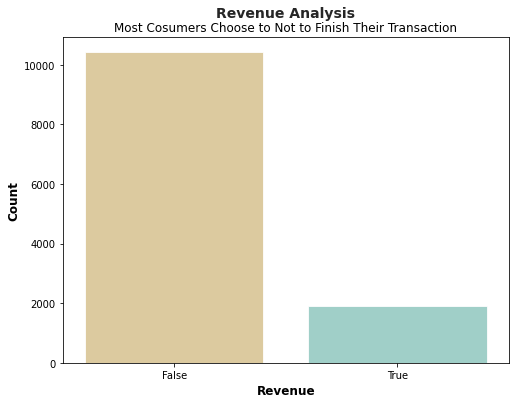
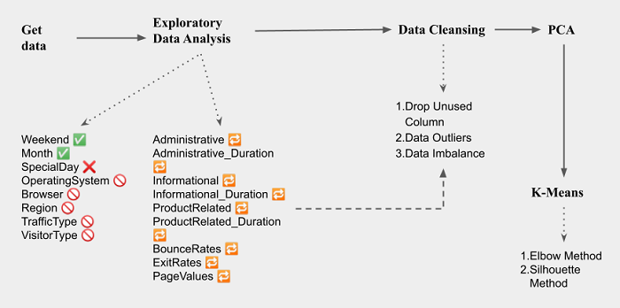

<h1 align="center">Predicting Customer Purchase Behavior using Customer Purchase Intention</h1>

This is an analysis to predict customer purchase behavior based on an analysis in customer purchase intention. Detailed explanation about this project available to read [here](https://medium.com/@afidasabrina/predicting-consumer-behavior-using-consumer-intention-analysis-c0272714ada6). Dataset in this analysis is part of the research by Sakar, POlat, and Katircioglu (2018). [Here's](https://archive.ics.uci.edu/ml/datasets/Online+Shoppers+Purchasing+Intention+Dataset#) the detailed information about it. 

## 📝Problem Statement

Understanding consumer behavior is one of the most crucial components to increase the growth of revenue. Based on data, consumers who finish the transaction are less than 20%. For this reason, understanding consumers' purchase intention will be a foundational information to understand users and source to develop a strategy to maximizing revenue.

  

## 🎇Solution

The goal of this project is to find out the predictors that drive intention to buy into buying behavior. Therefore, understanding the gap of behavior between consumers who buy the product and not is beneficial. In this case, PCA and K-means are the most suitable analysis method. Consumers will split into several clusters to make the process of analysis easier.

## 🧮Data Analysis

The analysis started with an understanding of variables in the dataset through Exploratory Data Analysis. Therefore, all those variables will be analyzed with Revenue. After that, consumers will be clustered based on similar behavior using k-means. The detailed process is depicted in the following figure.

  

All of the code related to analysis are available in the following link:

1.[Exploratory Data Analysis](https://github.com/afidas/consumers-purchase-intention/blob/main/EDA_Purchase_Intention.ipynb)

2.[K-means](https://github.com/afidas/consumers-purchase-intention/blob/main/K-Means_Purchase%20Intention.ipynb)

## ✏️ K-Means Outcome

Three is the best number for clustering consumers yielded by silhouette analysis. The group that considered has many buyers is clustered 0. Meanwhile, group 1 is predicted to have the least buyers.

  

## 🧩 Reference

1. [Customer Intention](https://medium.com/bukalapak-data/predicting-users-intention-when-searching-on-online-marketplace-platforms-a40a1792195a)  
2. Data Cleansing
    - Data Imbalance 
        - [10 Techniques to Deal with Class Imbalance in Machine Learning](https://www.analyticsvidhya.com/blog/2020/07/10-techniques-to-deal-with-class-imbalance-in-machine-learning/#h2_11) 
        - [Resampling to Properly Handle Imbalanced Datasets in Machine Learning](https://dev.to/charfaouiyounes/resampling-to-properly-handle-imbalanced-datasets-in-machine-learning-4anb) 
    - [Handling outliers](https://github.com/jayanandoth/Handling-Outliers/blob/master/Handling%20outliers.ipynb) 
3. [K-means](https://github.com/codebasics/py/blob/master/ML/13_kmeans/13_kmeans_tutorial.ipynb) 
4. [PCA](https://github.com/codebasics/py/blob/master/ML/18_PCA/PCA_tutorial_digits.ipynb) 
5. Output Analysis 
    - [Pivot table](https://pandas.pydata.org/docs/reference/api/pandas.pivot_table.html)
    - [Radar chart](https://www.pythoncharts.com/matplotlib/radar-charts/)
