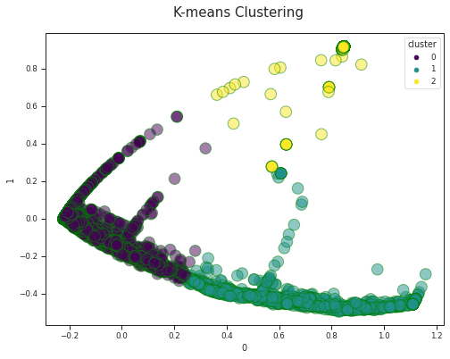

<h1 align="center">Predicting Customer Purchase Behavior using Customer Purchase Intention</h1>

This is an analysis to predict customer purchase behavior based on an analysis in customer purchase intention. **Slide presentation** about this project available to read [here](https://github.com/afidas/consumers-purchase-intention/blob/main/customer-intention-presentation.pdf). Dataset in this analysis is part of the research by Sakar, Polat, and Katircioglu (2018). [Here's](https://archive.ics.uci.edu/ml/datasets/Online+Shoppers+Purchasing+Intention+Dataset#) the detailed information about it. 

## 📝Problem Statement

Understanding consumer behavior is one of the most crucial components to increase the growth of revenue. Based on data, consumers who finish the transaction are less than 20%. For this reason, understanding consumers' purchase intention will be a foundational information to understand users and source to develop a strategy to maximizing revenue.

## 🎇Key Outcome

Understanding how customers move down the funnel to identify what to fix in the process to increase the number of transactions by answering several questions, such as: 
  
  1. Trend of Revenue by Month
  2. Customers Engagement (Page View and Page Duration) by Month
  3. Customers Engagement (Page View and Page Duration) by Visitor’s Type
  4. Is Engagement Performance Related to the Operating System?

## 🧮Data Analysis

The analysis started with an understanding of variables in the dataset through Exploratory Data Analysis. After that, consumers will be clustered based on similar behavior using k-means. All of the code related to analysis are available in the following link:

1.[Exploratory Data Analysis](https://github.com/afidas/consumers-purchase-intention/blob/main/EDA_Purchase_Intention.ipynb)
    
   1. Descriptive analysis
   2. Graph analysis

2.[PCA + K-means](https://github.com/afidas/consumers-purchase-intention/blob/main/K-Means_Purchase%20Intention.ipynb)
    
   1. Handling data imbalance
   2. Handling data outliers

## 📈 K-Means Outcome

Three is the best number for clustering consumers yielded by silhouette analysis.

  

## ✏️ Challenge
Data has many outliers and noise

## 🔑 Conclusion
  
  **Analysis Conclusion**
    
   1. Based on several variables used in clustering, three variables have the same value. Therefore, they're ineffective to be used as a basis of behavioral analysis. These variables are Informational, Informational Duration, and Page Values.
   2. Exit Rates and Bounce Rates have a high (0.91) correlation value based on heatmap analysis. It also happens in clustering analysis, the higher the bounce rates, the higher the exit rates.
   3. Page View and Page Duration in each cluster show a correlation because the more consumers access a page, the more time they spend.
    
   **Business Recomendation**
   
   Based on the analysis, the website's performance influences the amount of earned revenue. It can be improved by redesigning the user interface to create a better user experience.

## 🧩 Reference

1. [Customer Intention](https://medium.com/bukalapak-data/predicting-users-intention-when-searching-on-online-marketplace-platforms-a40a1792195a)  
2. [Bounce Rates](https://www.semrush.com/blog/learning-technical-seo/)  
3. Data Cleansing
    - Data Imbalance 
        - [10 Techniques to Deal with Class Imbalance in Machine Learning](https://www.analyticsvidhya.com/blog/2020/07/10-techniques-to-deal-with-class-imbalance-in-machine-learning/#h2_11) 
        - [Resampling to Properly Handle Imbalanced Datasets in Machine Learning](https://dev.to/charfaouiyounes/resampling-to-properly-handle-imbalanced-datasets-in-machine-learning-4anb) 
    - [Handling outliers](https://github.com/jayanandoth/Handling-Outliers/blob/master/Handling%20outliers.ipynb) 
4. [K-means](https://github.com/codebasics/py/blob/master/ML/13_kmeans/13_kmeans_tutorial.ipynb) 
5. [PCA](https://github.com/codebasics/py/blob/master/ML/18_PCA/PCA_tutorial_digits.ipynb) 
6. Output Analysis 
    - [Pivot table](https://pandas.pydata.org/docs/reference/api/pandas.pivot_table.html)
    - [Radar chart](https://www.pythoncharts.com/matplotlib/radar-charts/)
